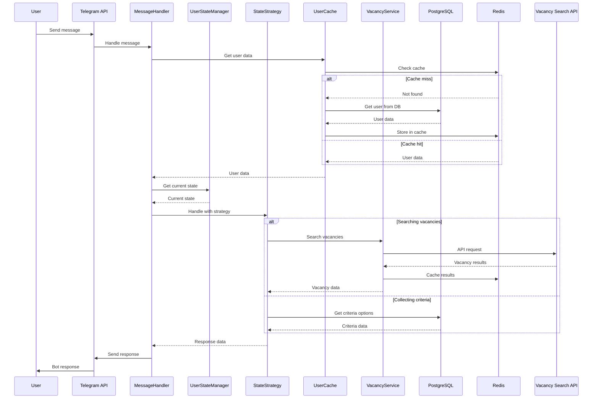

# JobDetectorBot
Карманный помощник в поиске вакансии мечты от команды Безработных.NET в составе:
 
@biktashevtimur
@marinesque


# 🤖 Telegram Bot для поиска вакансий

<div align="center">

[](https://dotnet.microsoft.com/)
[](https://core.telegram.org/bots)
[](https://www.postgresql.org/)
[](https://redis.io/)
[](LICENSE)

</div>

## 📋 Оглавление

- [ ✨ Возможности](#-возможности)
- [ 📁 Архитектура Бота](#-архитектура-бота)
- [ 🚀 Начало работы](#️-начало-работы)
- [ ⚙️ Конфигурация](#️-конфигурация)
- [ 🗄️ Структура базы данных](#️-структура-базы-данных)
- [ 🔄 Workflow интеграции](#️-workflow-интеграции)
- [ 📝 Лицензия](#-лицензия)


## ✨ Возможности

### 🎯 Основной функционал
- **Пошаговая настройка критериев** - интуитивный интерфейс ввода параметров поиска
- **Умный поиск вакансий** - интеграция с внешними API вакансий
- **Кэширование результатов** - быстрый доступ к предыдущим поискам
- **Пагинация** - удобная навигация по результатам

### 🎨 Пользовательский опыт
- **Интерактивные клавиатуры** - удобное управление через кнопки
- **Поддержка кастомных значений** - ввод произвольных параметров
- **Редактирование критериев** - возможность изменения сохраненных настроек
- **Состояние диалога** - запоминание позиции в разговоре

### ⚡ Технические особенности
- **Асинхронная обработка** - высокая производительность
- **Кэширование в Redis** - быстрое время отклика
- **Автоматические миграции** - простое обновление БД
- **Логирование** - детальный мониторинг работы

### 🛠️ Технологический стек

| Технология | Назначение | Версия |
|------------|------------|---------|
| **.NET** | Основная платформа | 8.0 |
| **Telegram.Bot** | Работа с Telegram API | 19.0 |
| **Entity Framework** | ORM для PostgreSQL | 8.0 |
| **PostgreSQL** | Основная база данных | 14+ |
| **Redis** | Кэширование данных | 6+ |
| **Docker** | Контейнеризация | 20+ |


## 📁 Архитектура Бота

TODO: 
mermaid
%%{init: {
  "themeVariables": {
    "fontSize": "18px",
    "fontFamily": "Inter, Helvetica, Arial, sans-serif",
    "edgeLabelBackground":"#fff"
  },
  "flowchart": { "curve": "step", "defaultRenderer": "elk", "htmlLabels": true }
}}%%
flowchart TB
  %% Legend
  subgraph LEGEND["Legend"]
    direction LR
    L1[fa:fa-cogs Application Layer]:::handler
    L2[fa:fa-database Infrastructure Layer]:::service
    L3[fa:fa-puzzle-piece Domain Layer]:::model
    L4[fa:fa-cloud External Services]:::external
  end

  %% System Layers as distinct subgraphs with block headings
  subgraph APP_LAYER["Application Layer fa:fa-cogs"]
    direction TB
    BBS([BotBackgroundService]):::handler
    RSBS([RedisSyncBackgroundService]):::handler
    MH([MessageHandler]):::handler
    USM([UserStateManager]):::handler

    subgraph STATE_STRATEGIES["State Strategies"]
      NSS([NoneStateStrategy]):::strategy
      ACS([AwaitingCriteriaStrategy]):::strategy
      SVS([SearchingVacanciesStrategy]):::strategy
    end
  end

  subgraph INF_LAYER["Infrastructure Layer fa:fa-database"]
    UCS([UserCacheService]):::service
    VSS([VacancySearchService]):::service
    UR([UserRepository]):::repository
    CSR([CriteriaStepRepository]):::repository
    DS([DataSeeder]):::service
    CSA([CriteriaStepsActualize]):::service
  end

  %% Domain Layer: separated DTOs, Response, Data Models
  subgraph DOMAIN_LAYER["Domain Layer fa:fa-puzzle-piece"]
    direction TB
    %% DTOs
    subgraph DTOs["DTOs"]
      UCD([UserCacheDto]):::dto
      VD([VacancyDto]):::dto
    end
    %% Response group
    subgraph RESPONSE[" Read Models"]
      UCR([UserCriteriaRequest]):::response
    end
    %% Data Models
    subgraph DATA_MODELS["Data Models"]
      U([User]):::model
      CS([CriteriaStep]):::model
      CSV([CriteriaStepValue]):::model
      UCSV([UserCriteriaStepValue]):::model
      US([UserState]):::model

      %% Relationships inside Data Models
      U --> UCSV
      CS --> CSV
    end

  end

  subgraph EXT_SERVICES["External Services fa:fa-cloud"]
    TB_API([Telegram Bot API]):::external
    PSQL([PostgreSQL Database]):::external
    REDIS([Redis Cache]):::external
    VACAPI([Vacancy Search API]):::external
    IDC([IDistributedCache]):::external
  end

  %% Flows within Application Layer
  BBS --> MH
  BBS -.-> TB_API
  MH --> USM
  MH -.-> U
  MH -.-> CS
  USM --> NSS
  USM --> ACS
  USM --> SVS

  %% Application <-> Infrastructure
  NSS --> UCS
  ACS --> UCS
  SVS --> UCS
  SVS --> VSS
  RSBS -.-> UR
  RSBS --> RE

  %% Infrastructure <-> External
  UCS --> REDIS
  UCS --> UR
  VSS --> REDIS
  VSS --> VACAPI
  UR --> PSQL
  CSR --> PSQL
  DS --> CSR
  CSA --> CSR
  UCS -.-> IDC

  %% Infrastructure usage relationship to Domain
  UCS -.-> UCD
  VACAPI -.-> VD
  VSS --> VD
  VSS -.-> UCR
  UR -.-> U
  CSR -.-> CS
  USM -.-> US
  UCD -.-> U
  UCSV -.-> CS
  UCSV -.-> CSV
  UCR -.-> U

  %% Styles for groups
  style APP_LAYER fill:#fffbe7,stroke:#bfc22f,stroke-width:3px,font-size:54px,color:black
  style INF_LAYER fill:#e7f7ff,stroke:#34aadc,stroke-width:3px,font-size:54px,color:black
  style DOMAIN_LAYER fill:#f7ebff,stroke:#b56edc,stroke-width:3px,font-size:54px,color:black
  style EXT_SERVICES fill:#ffecf0,stroke:#ed3268,stroke-width:3px,font-size:54px,color:black
  style LEGEND fill:#eafaea,stroke:#7db95e,stroke-width:1px,font-size:54px,color:black
  style DTOs fill:#e3eaff,stroke:#1965c7,stroke-width:2px,font-size:54px,color:black
  style RESPONSE fill:#ffe9e3,stroke:#df5824,stroke-width:2px,font-size:54px,color:black
  style DATA_MODELS fill:#e0ffe4,stroke:#43a047,stroke-width:2px,font-size:54px,color:black

  %% Custom styles/classes for nodes
  classDef external fill:#e1f5fe,stroke:#01579b,stroke-width:3px,font-weight:bold,font-size:54px,color:black;
  classDef service fill:#e3fcec,stroke:#156344,stroke-width:3px,font-size:54px,color:black;
  classDef repository fill:#fbeee5,stroke:#b05623,stroke-width:3px,font-size:54px,color:black;
  classDef model fill:#fff3e0,stroke:#ee9c00,stroke-width:3px,font-size:54px,color:black;
  classDef handler fill:#fff1f0,stroke:#e05858,stroke-width:3px,font-size:54px,color:black,stroke-dasharray: 5 2;
  classDef strategy fill:#ecffe1,stroke:#389e29,stroke-width:3px,font-size:54px,color:black;
  classDef dto fill:#e3eaff,stroke:#1965c7,stroke-width:2.5px,font-size:54px,color:black;
  classDef response fill:#ffe9e3,stroke:#df5824,stroke-width:2px,font-size:54px,color:black;

  %% Assign classes for legend
  class L1 handler; class L2 service; class L3 model; class L4 external;

  %% Assign classes for types
  class UCD,VD dto;
  class UCR response;DIS


## Схема взаимодействия компонентов



## 🚀 Начало работы

📋 Предварительные требования
- .NET 8 SDK
- PostgreSQL 14+
- Redis 6+
- Docker (опционально)

### ⚡ Локальная установка
Клонирование репозитория

```
git clone https://github.com/marinesque/JobDetectorBot.git
cd JobDetectorBot
```

## ⚙️ Конфигурация

### 📄 appsettings.json

```json
{
  "Logging": {
    "LogLevel": {
      "Default": "Information",
      "Microsoft.Hosting.Lifetime": "Information"
    }
  },
  "Telegram": {
    "Token": "YOUR_BOT_TOKEN"
  },
  "ConnectionStrings": {
    "PostgreSQL": "Host=localhost;Database=botdb;Username=postgres;Password=password;Port=5432",
    "Redis": "localhost:6379"
  },
  "VacancySearchService": {
    "BaseUrl": "http://localhost:5018"
  },
  "RedisOptions": {
    "ClearOnStartup": false
  }
}
```

## 🗄️ Структура базы данных


## 🔄 Workflow интеграции


