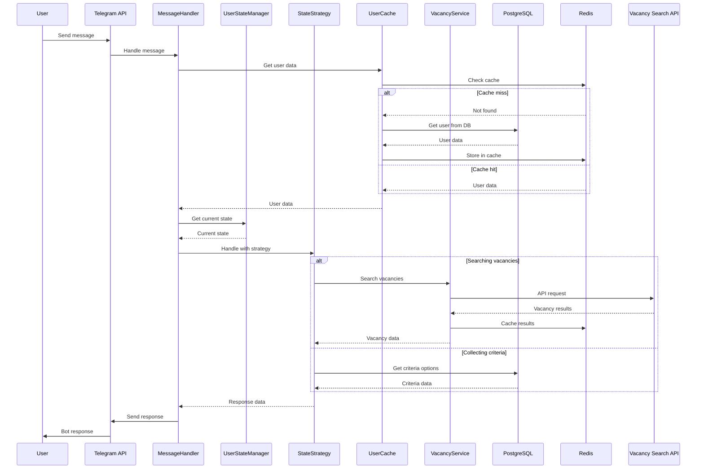

# JobDetectorBot
Карманный помощник в поиске вакансии мечты от команды Безработных.NET в составе:
 
@biktashevtimur
@marinesque


# 🤖 Telegram Bot для поиска вакансий

<div align="center">

[](https://dotnet.microsoft.com/)
[](https://core.telegram.org/bots)
[](https://www.postgresql.org/)
[](https://redis.io/)
[](LICENSE)

</div>

## 📋 Оглавление

- [ ✨ Возможности](#-возможности)
- [ 📁 Архитектура Бота](#-архитектура-бота)
- [ 🗄️ Структура базы данных](#-возможности)
- [ 🚀 Начало работы](#️-начало-работы)
- [ ⚙️ Конфигурация](#️-конфигурация)
- [ 🗄️ Структура базы данных](#️-структура-базы-данных)
- [ 🔄 Workflow интеграции](#️-workflow-интеграции)
- [ 📝 Лицензия](#-лицензия)
- [ Источники данных по вакансиям](#-источники-данных-по-вакансиям)


## ✨ Возможности

### 🎯 Основной функционал
- **Пошаговая настройка критериев** - интуитивный интерфейс ввода параметров поиска
- **Умный поиск вакансий** - интеграция с внешними API вакансий
- **Кэширование результатов** - быстрый доступ к предыдущим поискам
- **Пагинация** - удобная навигация по результатам

### 🎨 Пользовательский опыт
- **Интерактивные клавиатуры** - удобное управление через кнопки
- **Поддержка кастомных значений** - ввод произвольных параметров
- **Редактирование критериев** - возможность изменения сохраненных настроек
- **Состояние диалога** - запоминание позиции в разговоре

### ⚡ Технические особенности
- **Асинхронная обработка** - высокая производительность
- **Кэширование в Redis** - быстрое время отклика
- **Автоматические миграции** - простое обновление БД
- **Логирование** - детальный мониторинг работы

### 🛠️ Технологический стек

| Технология | Назначение | Версия |
|------------|------------|---------|
| **.NET** | Основная платформа | 8.0 |
| **Telegram.Bot** | Работа с Telegram API | 19.0 |
| **Entity Framework** | ORM для PostgreSQL | 8.0 |
| **PostgreSQL** | Основная база данных | 14+ |
| **Redis** | Кэширование данных | 6+ |
| **Docker** | Контейнеризация | 20+ |


## 📁 Архитектура Бота


## 🗄️ Структура базы данных


## 🔄 Workflow интеграции



## 🚀 Начало работы

📋 Предварительные требования
- .NET 8 SDK
- PostgreSQL 14+
- Redis 6+
- Docker (опционально)

### ⚡ Локальная установка
Клонирование репозитория

```
git clone https://github.com/marinesque/JobDetectorBot.git
cd JobDetectorBot
```

## ⚙️ Конфигурация

### 📄 appsettings.json

```json
{
  "Logging": {
    "LogLevel": {
      "Default": "Information",
      "Microsoft.Hosting.Lifetime": "Information"
    }
  },
  "Telegram": {
    "Token": "YOUR_BOT_TOKEN"
  },
  "ConnectionStrings": {
    "PostgreSQL": "Host=localhost;Database=botdb;Username=postgres;Password=password;Port=5432",
    "Redis": "localhost:6379"
  },
  "VacancySearchService": {
    "BaseUrl": "http://localhost:5018"
  },
  "RedisOptions": {
    "ClearOnStartup": false
  }
}
```

## Источники данных по вакансиям

- **HeadHunter API** - Вакансии получены с сайта hh.ru
  - API: https://api.hh.ru/
  - Соглашение разработчика: https://dev.hh.ru/admin/developer_agreement
  - **Использование**: исключительно в учебных целях
  - **Данные**: используются в неизменном виде
